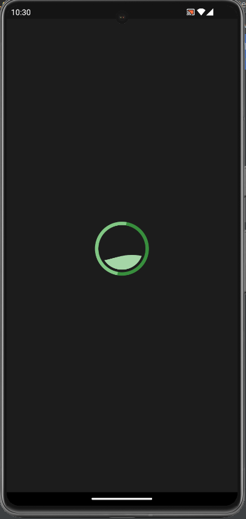
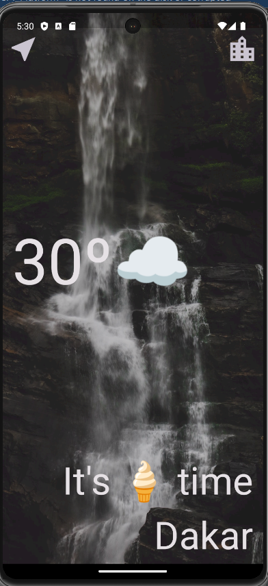
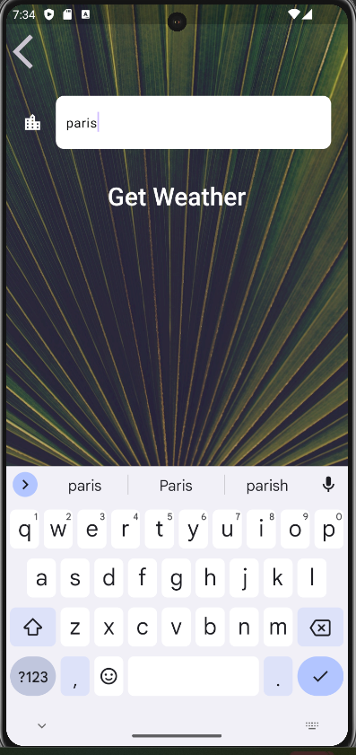
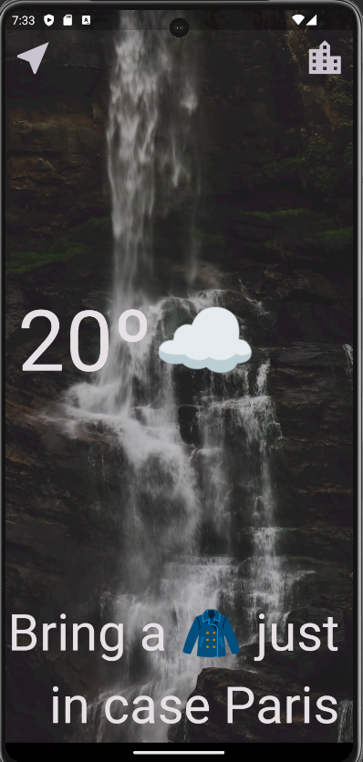
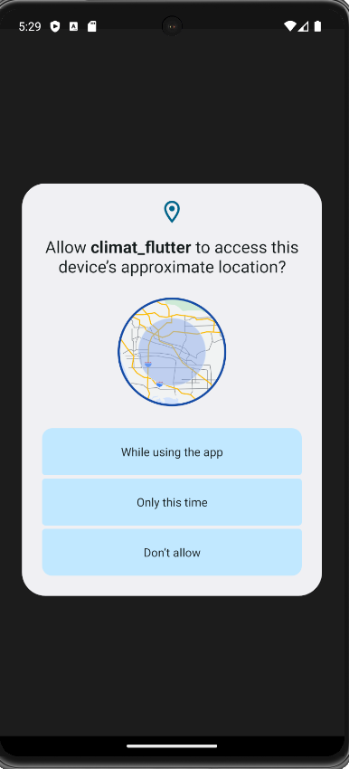

# Climat

This is a weather  app base on [OpenWeatherMap](https://openweathermap.org/current#current_XML)
## 1.Interfaces
### Loading page with spinkit / écran de chargement
Install [spinkit](https://pub.dev/packages/flutter_spinkit)
```
    flutter pub add flutter_spinkit`
 ```

### Accueil avec température et description du climat

### Changement de la localisation à Paris 

### Mise à jour effective

## 2.Geolocator
Install geolocator dependency on [pub dev] (https://pub.dev/packages/geolocator)
Installer la dépendence geolocator depuis le pub dev 
``````
   flutter pub add geolocator
 ``````
This will add a line like this to your package's pubspec.yaml (and run an implicit flutter pub get):
Ceci va ajouter ces lignes suivantes dans le fichier pubspec.yml
et vous faites un pub get pour mettre à les dépendances

    dependencies:
    geolocator: ^10.0.1

If you want to request permission to access the device's location you can call the requestPermission method:
Pour une requête de permission pour accès à la localisation de votre téléphone 
```
    import 'package:geolocator/geolocator.dart';
    LocationPermission permission = await Geolocator.requestPermission();
 ```



## 3.How to Call the API
`https://api.openweathermap.org/data/2.5/weather?lat=44.34&lon=10.99&appid={API key}`

Install the package [http](https://pub.dev/packages/http)
  
    String url = https://api.openweathermap.org/data/2.5/weather?lat=44.34&lon=10.99&appid={API key}
    var uri = Uri.tryParse(url);
    Response response = await get(uri!);
    if (response.statusCode == 200) {
        String data = response.body;
        Map<String, dynamic> map = jsonDecode(data);
        Temperature temperature = Temperature(map);
        print(temperature.temp.toInt());
        print(temperature.name);
        return temperature;
        }else{
        print('error:${response.statusCode}')
    }

    
## 4. Built-in API request by city name
    https://api.openweathermap.org/data/2.5/weather?q={city name}&appid={API key}   
 ```lat```	required	Latitude /la  latitude est requise. 

 ```lon```required	Longitude /Longitude est requise. 

```appid```	required / la clé de l'API est requise.	
    Your unique API key (you can always find it on your account page under the "API key" tab)
    Votre clé d'API est unique.
##  JSON format API response example
````````
    {
  "coord": {
    "lon": 10.99,
    "lat": 44.34
  },
  "weather": [
    {
      "id": 501,
      "main": "Rain",
      "description": "moderate rain",
      "icon": "10d"
    }
  ],
  "base": "stations",
  "main": {
    "temp": 298.48,
    "feels_like": 298.74,
    "temp_min": 297.56,
    "temp_max": 300.05,
    "pressure": 1015,
    "humidity": 64,
    "sea_level": 1015,
    "grnd_level": 933
  },
  "visibility": 10000,
  "wind": {
    "speed": 0.62,
    "deg": 349,
    "gust": 1.18
  },
  "rain": {
    "1h": 3.16
  },
  "clouds": {
    "all": 100
  },
  "dt": 1661870592,
  "sys": {
    "type": 2,
    "id": 2075663,
    "country": "IT",
    "sunrise": 1661834187,
    "sunset": 1661882248
  },
  "timezone": 7200,
  "id": 3163858,
  "name": "Zocca",
  "cod": 200
}                        

````````

    
